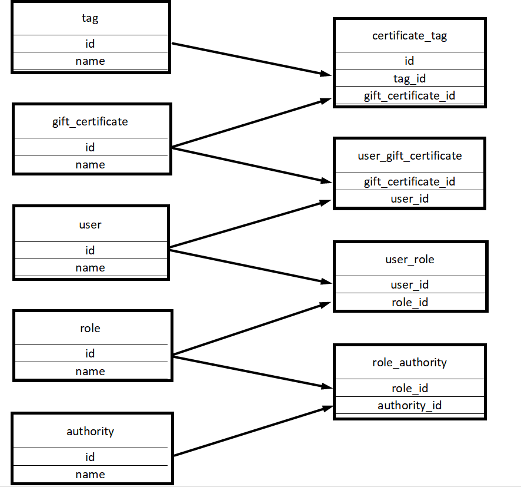
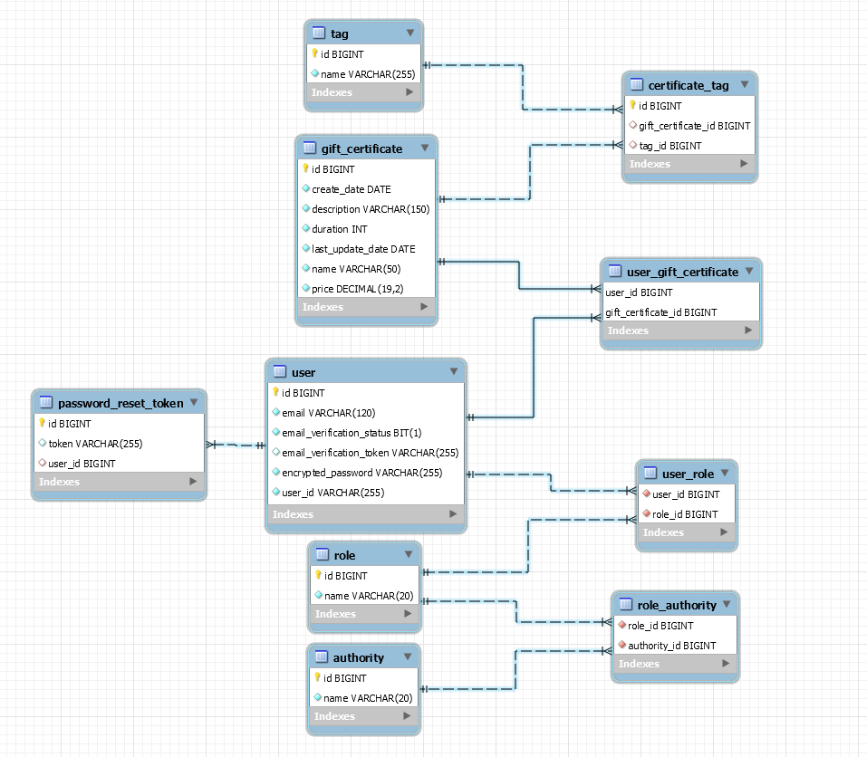

# LabProject

The project represent certificates system. 
Certificates have some data and tags with many-to many relationship as imagined below. 

CreateDate, LastUpdateDate - format ISO 8601 (https://en.wikipedia.org/wiki/ISO_8601). 
The system expose REST APIs to perform the following operations:
CRUD operations for GiftCertificate.
CRUD operations for Tag.
Get certificates with tags (all params are optional and can be used in conjunction):
by tag name (ONE tag)
search by part of name (can be implemented, using DB function call)
sort by date or by name ASC/DESC (extra task: implement ability to apply both sort type at the same time).

There are implemented Users and their roles.

1. Spring Security are used as a security framework.
2. Application support only stateless user authentication and verify integrity of JWT token.
3. Users are stored in a database with some basic information and a password.

User Permissions:

     - Guest (no role):
        * Read info about certificates and tags
        * Signup.
        * Login.
        * Email verification request
     - ROLE_URSER:
        * Make add certificates to himself
        * All read operations (exclusive private info about others users)
        * Delete himself
        *  
     - ROLE_ADMIN (can be added only via database call and InitialUserSetup.class):
        * All operations, including addition and modification of entities.

The scheme of entities:

More sophisticated scheme describing entity relationships:

