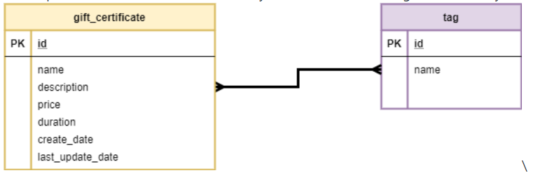

# LabProject
Business requirements
Develop web service for Gift Certificates system with the following entities (many-to-many):

CreateDate, LastUpdateDate - format ISO 8601 (https://en.wikipedia.org/wiki/ISO_8601). Example: 2018-08-29T06:12:15.156. More discussion here: https://stackoverflow.com/questions/3914404/how-to-get-current-moment-in-iso-8601-format-with-date-hour-and-minute
Duration - in days (expiration period)
The system should expose REST APIs to perform the following operations:
CRUD operations for GiftCertificate. If new tags are passed during creation/modification – they should be created in the DB. For update operation - update only fields, that pass in request, others should not be updated. Batch insert is out of scope.
CRD operations for Tag.
Get certificates with tags (all params are optional and can be used in conjunction):
by tag name (ONE tag)
search by part of name/description (can be implemented, using DB function call)
sort by date or by name ASC/DESC (extra task: implement ability to apply both sort type at the same time).
